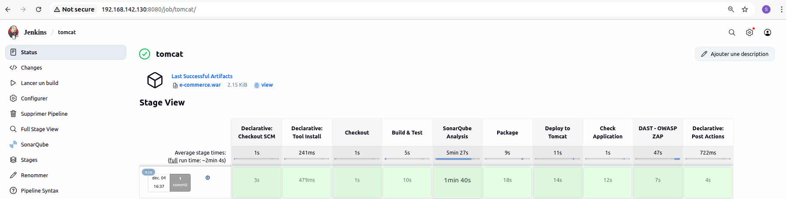
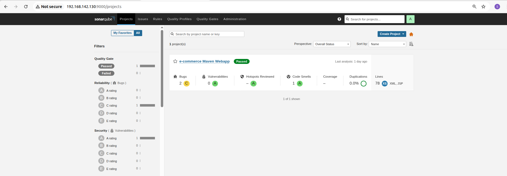
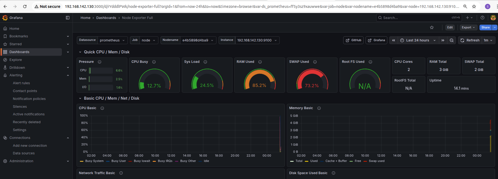

# 🚀 DevSecOps CI/CD Pipeline for Java Application

This project implements a **complete DevSecOps pipeline** for a Java (Maven) application using **Jenkins, SonarQube, OWASP ZAP, Tomcat, Prometheus, and Grafana** on a **single Ubuntu VM**.

It covers the full lifecycle:
**Code → Build → Test → Security Scan → Deploy → Monitor**

---

## 🧱 Project Architecture

> 🖥️ All services are hosted on **one Ubuntu Virtual Machine**

```
Developer → GitHub → Jenkins → Maven Build & Tests
                       ↓
                SonarQube (SAST)
                       ↓
                Package (WAR)
                       ↓
                Deploy to Tomcat
                       ↓
                OWASP ZAP (DAST)
                       ↓
        Prometheus + Node Exporter → Grafana
```

📌 *(You can also add a real diagram image later)*

---

## 🛠️ Tools & Technologies Used

| Category           | Tools                              |
| ------------------ | ---------------------------------- |
| OS                 | Ubuntu                             |
| Language           | Java 17                            |
| Build Tool         | Maven                              |
| CI/CD              | Jenkins                            |
| Application Server | Apache Tomcat 9                    |
| SAST               | SonarQube (Docker)                 |
| DAST               | OWASP ZAP                          |
| Containers         | Docker                             |
| Monitoring         | Prometheus, Node Exporter, Grafana |
| Version Control    | GitHub                             |

---

## 🔄 Jenkins Pipeline Stages

1. **Checkout** – Fetch source code from GitHub
2. **Build & Test** – Compile and run tests using Maven
3. **SonarQube Analysis (SAST)** – Static security analysis
4. **Package** – Generate WAR file
5. **Deploy to Tomcat** – Automatic deployment
6. **Application Check** – Verify app with `curl`
7. **OWASP ZAP Scan (DAST)** – Dynamic security analysis

---

## 📸 Pipeline & Security Reports (Screenshots)


### ✅ Jenkins Pipeline



### ✅ SonarQube SAST Report



### ✅ OWASP ZAP DAST Report


### ✅ Grafana Monitoring Dashboard



---

## ▶️ How to Run This Project Locally

### 1️⃣ Install Required Packages

```bash
sudo apt update
sudo apt install -y git docker.io openjdk-17-jdk maven tomcat9
```

---

### 2️⃣ Clone the Repository

```bash
git clone https://github.com/YOUR-USERNAME/YOUR-REPO.git
cd YOUR-REPO
```

---

### 3️⃣ Start SonarQube (Docker)

```bash
docker run -d --name sonarqube -p 9000:9000 sonarqube:lts
```

---

### 4️⃣ Start Prometheus, Node Exporter & Grafana

```bash
docker run -d --name prometheus -p 9090:9090 prom/prometheus
docker run -d --name node-exporter -p 9100:9100 prom/node-exporter
docker run -d --name grafana -p 3000:3000 grafana/grafana
```

---

### 5️⃣ Configure Jenkins

* Install plugins:

  * Git
  * Maven
  * SonarQube Scanner
* Add:

  * GitHub credentials
  * SonarQube token

---

### 6️⃣ Run the Jenkins Pipeline

* Create a Jenkins pipeline
* Add your `Jenkinsfile`
* Click **Build Now**

✅ The application will be automatically **built, scanned, deployed, and monitored**

---

## 🔐 Security Integration (DevSecOps)

* **SonarQube** blocks the pipeline if code quality is poor
* **OWASP ZAP** dynamically scans the deployed application
* Reports are generated automatically after each run

---

## 📊 Monitoring & Observability

* **Node Exporter** collects system metrics
* **Prometheus** stores metrics
* **Grafana** visualizes:

  * CPU
  * RAM
  * Disk
  * Application health

---

## ⚠️ Common Issues & Fixes

| Problem                   | Solution                    |
| ------------------------- | --------------------------- |
| Jenkins permission denied | Add Jenkins to sudo group   |
| Tomcat port conflict      | Modify `server.xml`         |
| SonarQube token error     | Regenerate and update token |
| ZAP not blocking build    | Add exit code handling      |

---

## ✅ CI/CD Flow Summary

```
GitHub → Jenkins → Build & Test → SonarQube (SAST)
       → Package → Deploy to Tomcat → ZAP (DAST)
       → Prometheus → Grafana
```

---

## 🎯 Project Outcome

This project demonstrates:

* ✅ Full **CI/CD automation**
* ✅ Real **DevSecOps integration**
* ✅ Automated **deployment**
* ✅ **Production-level monitoring**
* ✅ Professional **Jenkins pipeline design**

---

## 👨‍💻 Author

**Mohamed Tlili**
Junior DevOps Engineer
GitHub: `@Med-Tl`

---

✅ This project is **job-ready and interview-ready**.
